<div align="center">
  <h1>Automated Optical Inspection (AOI) for Hole Diameter Measurement</h1>
</div>
  <h3>A robust C++ application for high-precision, automated measurement of industrial parts from image data.</h3>
---

## 🚀 Overview

This project is a powerful C++-based Automated Optical Inspection (AOI) system designed to analyze images of industrial components and precisely measure the diameter of various holes. It operates by processing a directory of images in bulk, intelligently selecting the best algorithm for each feature, and exporting the results to a structured CSV file for data analysis.

The system is built to be robust, configurable, and efficient, leveraging the **OpenCV** library for all computer vision tasks.

---

## ⚙️ Project Pipeline

The core of this application is a sophisticated pipeline that ensures accurate and reliable measurements. The process flow can be visualized as follows:

```mermaid
graph TD
    A[📁 Start: Image Directory] --> B{Scan for Images};
    B --> C[Parse Filename w/ Regex];
    C --> D{Filter by Exposure?};
    D -- Yes --> E[🖼️ Load Image];
    D -- No --> B;
    E --> F[Mask 20px Corners];
    F --> G{Select Algorithm by Hole ID};
    
    subgraph RC Group Logic
        G -- "SP9, etc." --> H[Threshold];
        H --> I[Find Contours];
        I --> J[Filter Contours by Area/Size];
        J --> K[Fit Circle w/ RANSAC];
    end

    subgraph ML/LA Group Logic
        G -- "LA2, ML2, etc." --> L[Coarse Find w/ Hough Transform];
        L --> M[Refine Edge via Radial Scan];
        M --> N[Fit Circle w/ RANSAC];
        N --> O{Success?};
        O -- No --> K;
        O -- Yes --> P[Calculate Diameter];
    end

    K --> P;
    P --> Q[💾 Save Annotated Image];
    Q --> R[Aggregate Data in Map];
    R --> S{Cycle Complete?};
    S -- No --> B;
    S -- Yes --> T[📝 Append Row to CSV];
    T --> B;
```



---

## 🔍 Pipeline Stages Explained

**1. File Scanning & Parsing**:  
Recursively scans a specified parent folder for `.png` images and parses metadata like `cycleID`, `stationNumber`, `holeID`, and `exposure` using regex.

**2. Filtering**:  
Filters images based on `holeID` and `exposure` using a predefined map.

**3. Corner Masking**:  
Applies a 20x20 pixel white mask to all image corners to suppress fiducial markers.

**4. Algorithm Selection**:  
- **RC Group (Contour-based)**: Uses thresholding, contour detection, and RANSAC circle fitting for high-contrast holes.
- **ML/LA Group (Gradient-based)**: Uses Hough Transform and radial gradient scan for complex or low-contrast holes.

**5. Result Calculation & Output**:  
- Circle radius in pixels is converted to millimeters using a constant `PIXELS_PER_MM`.
- Annotated images and CSV results are saved.

**6. Data Aggregation & CSV Export**:  
Results are stored per `cycleID`, and once a full set is processed, a row is written to the master CSV.

---

## 🛠️ Getting Started

### ✅ Prerequisites

- **C++ Compiler**: MSVC (Visual Studio) with C++17 support  
- **CMake**: Version 3.10+  
- **OpenCV**: Pre-built binaries properly installed and configured  

---

### 🔧 1. Clone the Repository

```bash
git clone https://github.com/SARATH062005/Hole_Dia_Detection.git
cd Hole_Dia_Detection
```

---

### ✏️ 2. Configure Paths

In `main.cpp`, modify:

```cpp
std::string parentFolder = "D:/path/to/your/images/"; 
std::string csvPath = "D:/path/to/your/output/results.csv";
```

---

### 🧱 3. Build the Project (Windows)

Use the **Developer Command Prompt for Visual Studio**:

```cmd
cd C:\path\to\your\repository
rmdir /s /q build
mkdir build
cd build
cmake .. -G "NMake Makefiles" -DOpenCV_DIR="D:\path\to\opencv\build"
nmake
```

---

### ▶️ 4. Run the Application

```cmd
YourProjectName.exe
```

The application will read images from `parentFolder` and write results to `csvPath`. Progress is printed to the terminal.

---

<div align="center">
<h3 align="center">Built with ❤️ and C++ by Sarath Chandiran</h3>
</div>
